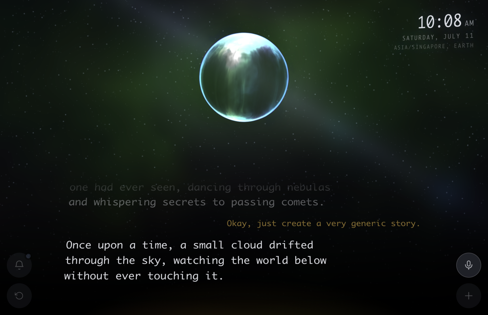

# Serry - Voice Agent for Mac

**Serry is a  helpful, ethereal, LOCAL AI voice agent for Mac** — happiest on an Apple Silicon machine with **more than 96 GB of unified memory**.



She lives on your computer, sees your world — your files, mail, calendar, notifications — remembers what matters to you, and talks back in a warm, natural voice. And she does it all without your data ever leaving the computer.

## What she does

- Runs a **fully local** voice assistant that's surprisingly capable and quick to answer
- Keeps and manages **memories** about the people and tasks in your life — written as plain notes you can read, change, or add to yourself in your Mac Notes app
- **Reads your notifications** aloud while respecting how you've set up your Mac — if Focus, Do Not Disturb, or sleep are hushing things, so is she
- Reaches into your **files, email, calendar, contacts, notes, and reminders**
- **Looks things up** on the web, checks the weather and the markets
- Can **hand a hard question to a bigger, faster cloud model** when it helps — and tells you out loud when she does

## How she does it

- **Offline by default**, thinking with a local model running in [LM Studio](https://lmstudio.ai) (Best with Qwen3.5 110B)
- **Learns your voice**, so she only ever answers *you* — you can even teach her which other voices (a housemate, the TV) to ignore
- Answers to her name: *"Serry, can you…"* or *"…, Serry"* — then keeps listening for a moment so you can carry on without repeating it
- **Responsive, high-quality speech**, back and forth, turn by turn
- **Nothing leaves your machine** except the web searches and cloud hand-offs you can hear happen
- Looks properly out of this world ✨

Built on [Pipecat](https://github.com/pipecat-ai/pipecat), the open-source framework for real-time voice agents.

---

## What you'll need

- A Mac with **Apple Silicon** and, ideally, **more than 96 GB of unified memory** — that headroom is what lets the big local model, the speech models, and everything else run smoothly at once. Less memory still works with a smaller model, just less capably.
- A microphone (the built-in one is fine)
- **[LM Studio](https://lmstudio.ai)** — this is what runs Serry's "brain" locally
- **[uv](https://docs.astral.sh/uv/)** and **Node.js** — used to install and run everything

You don't need any accounts or API keys to get going. A few optional online features (deeper web search, live stock prices, a cloud model to escalate to) can be switched on later by adding keys — more on that below.

---

## Getting started

### 1. Get the code and install

```bash
git clone https://github.com/serrynaimo/serrynaimo-agent.git
cd serrynaimo-agent/server
uv sync
```

The first run also downloads Serry's speech models (about 7 GB), so give it a minute.

### 2. Set up her brain (LM Studio)

1. Install **[LM Studio](https://lmstudio.ai)**.
2. Download a capable model — **Qwen3.5 110B-A10B** is the current favourite on a 96 GB+ Mac. Something smaller probably works, but can be frustrating at times.
3. Load it, then start LM Studio's **local server** (Developer → Start Server).
4. In the model's settings, turn **off** reasoning (thinking) parsing. Serry manages the model's reasoning herself, and letting LM Studio split out the "thinking" section can garble or slow her spoken replies.

Serry automatically uses whichever model you've loaded — you don't have to name it anywhere.

### 3. Introduce yourself

Copy the example settings file and open it:

```bash
cp .env.example .env
```

The only things really worth setting are the names — what to call her, and who she's helping:

```bash
AGENT_NAME=Serrynaimo      # her full name
AGENT_NAME_SHORT=Serry     # what you call her (this becomes her wake word)
USER_NAME=Jane Doe         # you
USER_NAME_SHORT=Jane
```

Everything else has a sensible default. If you later want the optional online extras, this same file is where you'd paste in the relevant keys (each is labelled with what it unlocks).

### 4. Run the bot server

```bash
uv run bot.py
```

Open the link it prints, allow the microphone when macOS asks, and say hello. The first time she checks your mail, calendar, or notifications, macOS will ask permission for those too — just allow it.

She looks her best in **Chrome's fullscreen mode on a dedicated monitor** — the glowing orb becomes an ambient presence on your desk, always a wake-word away.

### 5. Teach her your voice and introduce

So Serry answers only you, open the **calibration** page at **[http://localhost:7860/calibration](http://localhost:7860/calibration)**. Record yourself a few times, and — just as importantly — record a few voices to *ignore*: someone else in the room, a podcast, the TV. She'll tune herself to you automatically. That's it.

### 6. Open her in your browser

Point a browser at **[http://localhost:7860/serrynaimo](http://localhost:7860/serrynaimo)** to meet her — the glowing orb and her controls. This is the address to open in Chrome's fullscreen mode on a dedicated monitor.

---

## Permissions she'll ask for

Because Serry does real things on your Mac, macOS will ask your permission the first time she reaches for each one. You can allow them as the prompts pop up — or manage them any time under **System Settings → Privacy &amp; Security**.

- **Microphone** — so she can hear you. You'll be asked the moment you start talking.
- **Accessibility** — so she can see your notification banners (and stay quiet when Focus or Do Not Disturb are on). Under *Privacy &amp; Security → Accessibility*.
- **Automation** — so she can reach Mail, Calendar, Contacts, Notes, and Reminders. Each app asks the first time she touches it; review them under *Privacy &amp; Security → Automation*.

One thing worth knowing: because you start Serry from the Terminal, these permissions are granted to your **terminal app**, not to Serry directly. If you ever tap "Don't Allow" by mistake, open the matching list in *System Settings → Privacy &amp; Security*, find your terminal, and switch it back on (then quit and reopen the terminal so it takes effect).

---

## A quick tour

Serry is a single glowing orb on a dark canvas, with four soft controls in the corners.

### The buttons

| Button | What it does |
| --- | --- |
| **＋ Type a message** | Prefer to type? Opens a text box to talk to her silently |
| **🎙 Stop &amp; mute** | Puts her to sleep — she'll wait for her name again. The label changes to **"Speak now"** while muted. Tap again to wake her |
| **🔔 Notifications** | Turns reading your notifications aloud on or off (on by default) |
| **↻ New session** | Starts a fresh conversation |

### Keyboard shortcuts

| Key | Action |
| --- | --- |
| Start typing / **Enter** | Opens the message box (your first keystroke lands in it) |
| **Delete / Backspace** | Mute or wake her |
| **Esc** | Stop her mid-sentence |
| **⌘N** | Start a new session |

### Just talk to her

Say her name anywhere in your first breath — *"Serry, what's on my calendar today?"* or *"read me that email, Serry"* — and then keep going for a few seconds without repeating it.

- **Mail** — "read, search, or send an email"
- **Calendar** — "what's on today?", "am I free Thursday afternoon?"
- **Reminders & Contacts** — "remind me to…", "what's Alex's number in my contacts?"
- **Notes** — "make a note that…", "what did I note about…?"
- **Files** — "find the file about…", "read me that PDF in Downloads", "open it in the browser"
- **Recent notifications** - "What did my mom write this morning?" (Only if agent was running at time of notification)
- **The world** — "search the web for…", "what's the weather this weekend?", "how's the market doing?"
- **Memory** — "remember that Jane likes morning meetings", "what do you know about Alex?"
- **When it's hard** — she may say *"let me check on that"* and quietly hand the question to a stronger cloud model, with your personal details kept out of it

You can also just tell her to **be quiet** ("shut up", "stop", "thank you") or to **start over** ("start a new session") — she handles those herself, without sending them anywhere.

---

## Optional online extras

Serry is fully capable offline. These optional services simply extend her reach into the wider world — switch on only the ones you want by pasting a key into your `.env`. Weather already works out of the box, with no key at all (via the free [Open-Meteo](https://open-meteo.com)).

### Grok — a bigger brain, plus live web &amp; X search (paid)

Lets Serry escalate a hard question to xAI's **Grok**, and powers her deep **web search** and **X (Twitter) search**. This one is **paid** — create a key in the [xAI console](https://console.x.ai).

```bash
XAI_API_KEY=your-key-here
#XAI_MODEL=grok-4.5     # optional — this is already the default
```

### Google search — everyday web lookups (free, ~100/day)

A free way to give Serry general web search (she falls back to this when Grok isn't set up). It needs **two** values: an API key and a search-engine ID. Create a Programmable Search Engine at [programmablesearchengine.google.com](https://programmablesearchengine.google.com), then get the key from the [Custom Search docs](https://developers.google.com/custom-search/v1/overview). Free for roughly **100 searches a day**.

```bash
GOOGLE_SEARCH_API_KEY=your-key-here
GOOGLE_SEARCH_ENGINE_ID=your-engine-id
```

### Alpha Vantage — stocks, currencies &amp; crypto (free, 25/day)

Gives Serry live stock quotes, company fundamentals, exchange rates, and crypto prices. Grab a free key at [alphavantage.co](https://www.alphavantage.co/support/#api-key) — the free tier allows **25 lookups a day**.

```bash
ALPHA_VANTAGE_API_KEY=your-key-here
```

### Daily — an alternative connection (optional)

Only needed if you swap Serry's default on-device connection for [Daily](https://www.daily.co)'s hosted WebRTC. Most people never touch this — leave it blank.

```bash
#DAILY_API_KEY=your-key-here
```

Weather (via Open-Meteo) needs nothing, and the local speech and language models never require a key — everything above is strictly optional.

---

## Her memory is yours to edit

Serry remembers things in **plain notes in the Apple Notes app** — nothing hidden, all yours. Open Notes and look for the folder named after her (e.g. **Serrynaimo**):

- **General** — odds and ends that aren't about anyone in particular
- **Profiles** — a note for each person she knows, and one about you
- **Actions** — little how-tos she's picked up along the way

Each memory is just a **paragraph**. Want to change what she knows? Edit the text like any note:

- **Add** something — write a new paragraph
- **Fix** something — reword it
- **Make her forget** — delete the paragraph

She notices your edits within a few seconds and updates herself — no restart, no special formatting to worry about. She also writes here on her own whenever she learns something worth keeping, and she glances at these notes every time you talk, so anything you jot down surfaces naturally in conversation.

---

## Your privacy

Everything — understanding your speech, thinking, speaking back, and reaching your files, mail, and memories — happens **on your Mac**. The only things that ever leave are:

1. the **web, weather, and market lookups** you ask for, and
2. the occasional **hand-off to a cloud model** for a tough question — which she says out loud, and sends with your identifying details masked.


---

## Give her a voice

Serry comes with her own bundled voice, but you can give her any voice you like — either **designed from a description** or **cloned from a recording**.

### Design one from a description

Tell her how she should sound, and let her invent a matching voice.

1. In your `.env`, describe the voice you're after:

   ```bash
   QWEN3_TTS_INSTRUCT=a warm, calm female with a soft British lilt
   ```

2. Generate a few candidates and listen to them:

   ```bash
   uv run design_voice.py     # creates voice_ref_1.wav, voice_ref_2.wav, ...
   afplay voice_ref_1.wav     # have a listen
   ```

3. Pick your favourite. The script prints the exact lines to paste into `.env` — pointing her at the winning clip and its reference sentence. Restart her and she speaks in the new voice.

### Clone one from a recording

Already have a voice you love? Give her a short clip to imitate.

1. Record **3–10 seconds** of the voice speaking clearly, and jot down the exact words spoken.
2. In your `.env`, point her at the clip and its transcript:

   ```bash
   QWEN3_TTS_REF_AUDIO=/path/to/your-clip.wav
   QWEN3_TTS_REF_TEXT=the exact words spoken in that recording
   ```

Restart her, and she'll take on the new voice. (A rich, varied sentence with lots of different sounds clones best.)

---

## Credits & license

Built on [Pipecat](https://github.com/pipecat-ai/pipecat) for the voice pipeline, local speech models running on Apple's MLX, and a local model served by [LM Studio](https://lmstudio.ai).

Licensed under the [Apache License 2.0](LICENSE). Copyright © 2026 Thomas Gorissen.
